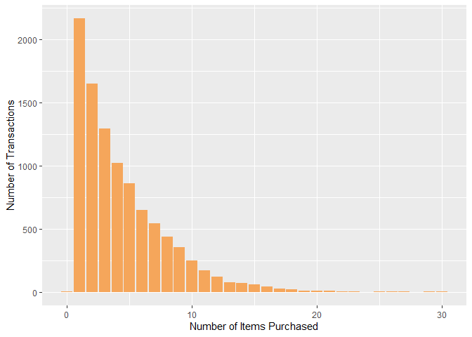
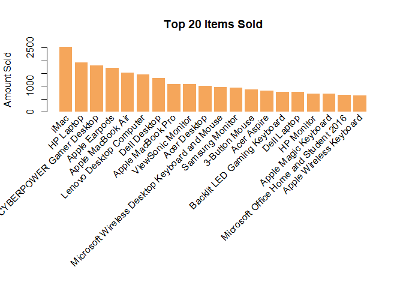
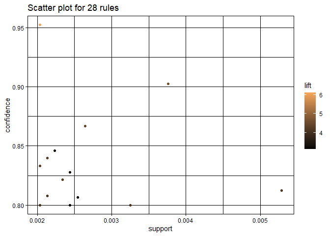
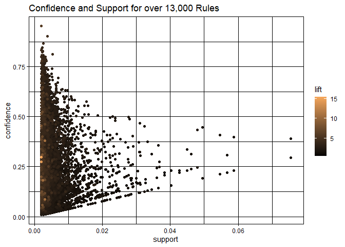
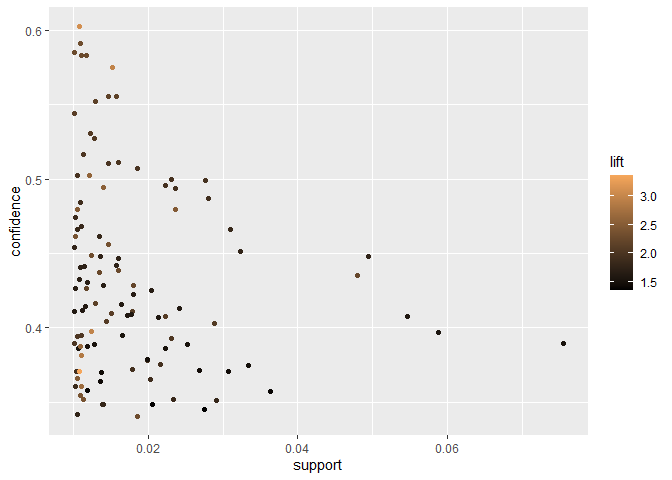
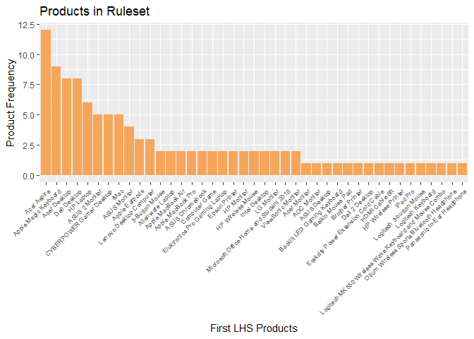
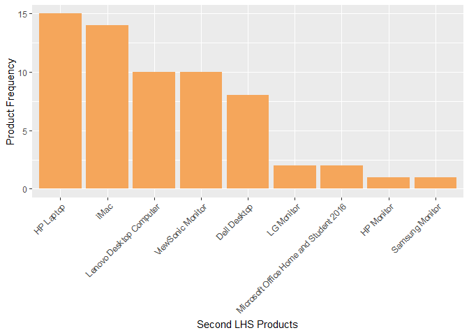
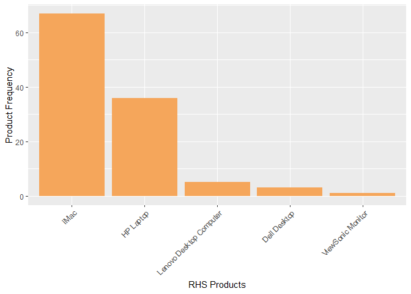

Market Basket
================
JRyback
2022-12-04

# Market Basket Analysis

Blackwell’s board of directors is considering acquiring a startup online
competitor called Electronidex. Before they make their decision, they
would like to get a better idea of the purchasing patterns of their
customers. I used R to perform a market basket analysis of
Electronidex’s online transactions to find any associations between the
products purchased in each transaction. Ultimately, the board would like
my recommendation on whether to purchase Electronidex and which
sales-oriented initiatives to use to capitalize on these associations.

For this project, I will be using a Market Basket Analysis. This model
is typically used on transaction data. It takes the items that were
purchased in each transaction and examines them to determine which items
were frequently purchased together. From there, we can create rules that
we can use later to predict customer purchases based on what they have
already bought.

``` r
library(arules)
```

    ## Loading required package: Matrix

    ## 
    ## Attaching package: 'arules'

    ## The following objects are masked from 'package:base':
    ## 
    ##     abbreviate, write

``` r
library(arulesViz)
library(tidyverse)
```

    ## ── Attaching packages
    ## ───────────────────────────────────────
    ## tidyverse 1.3.2 ──

    ## ✔ ggplot2 3.3.6      ✔ purrr   0.3.4 
    ## ✔ tibble  3.1.8      ✔ dplyr   1.0.10
    ## ✔ tidyr   1.2.1      ✔ stringr 1.4.1 
    ## ✔ readr   2.1.2      ✔ forcats 0.5.2 
    ## ── Conflicts ────────────────────────────────────────── tidyverse_conflicts() ──
    ## ✖ tidyr::expand() masks Matrix::expand()
    ## ✖ dplyr::filter() masks stats::filter()
    ## ✖ dplyr::lag()    masks stats::lag()
    ## ✖ tidyr::pack()   masks Matrix::pack()
    ## ✖ dplyr::recode() masks arules::recode()
    ## ✖ tidyr::unpack() masks Matrix::unpack()

``` r
library(ggplot2)
library(shiny)
library(RColorBrewer)
```

The packages I will be using in this project. Arules and arulesviz are
packages specifically designed for a market basket analysis. Arules
analyzes the transaction data and makes rules based on the associations
between products. These rules will be based on criteria which I will
explain later. Arulesviz creates visualizations based on the rules set
by arules. Ggplot2, as always, allows me to create some excellent
visualizations.

## The Transaction Data

``` r
trans <- read.transactions('MarketBasket/ElectronidexTransactions2017.csv', 
                           format = 'basket', rm.duplicates = TRUE, sep = ',')
```

    ## distribution of transactions with duplicates:
    ## items
    ##   1   2 
    ## 191  10

``` r
summary(trans)
```

    ## transactions as itemMatrix in sparse format with
    ##  9835 rows (elements/itemsets/transactions) and
    ##  125 columns (items) and a density of 0.03506172 
    ## 
    ## most frequent items:
    ##                     iMac                HP Laptop CYBERPOWER Gamer Desktop 
    ##                     2519                     1909                     1809 
    ##            Apple Earpods        Apple MacBook Air                  (Other) 
    ##                     1715                     1530                    33622 
    ## 
    ## element (itemset/transaction) length distribution:
    ## sizes
    ##    0    1    2    3    4    5    6    7    8    9   10   11   12   13   14   15 
    ##    2 2163 1647 1294 1021  856  646  540  439  353  247  171  119   77   72   56 
    ##   16   17   18   19   20   21   22   23   25   26   27   29   30 
    ##   41   26   20   10   10   10    5    3    1    1    3    1    1 
    ## 
    ##    Min. 1st Qu.  Median    Mean 3rd Qu.    Max. 
    ##   0.000   2.000   3.000   4.383   6.000  30.000 
    ## 
    ## includes extended item information - examples:
    ##                             labels
    ## 1 1TB Portable External Hard Drive
    ## 2 2TB Portable External Hard Drive
    ## 3                   3-Button Mouse

The data consisted of over 9,800 transactions and 125 products. It
included no other information about the customer or products. It is in a
sparse matrix form, meaning that instead of variables, the columns were
merely the amount of items purchased in that transaction. If four items
were purchased in a transaction, then that row would have four columns.
Not every row has the same number of columns.

### Number of items purchased

``` r
transSize <- size(trans)
transSize2 <- as.data.frame(transSize)
ggplot() + geom_bar(transSize2, mapping=aes(x=transSize), fill='#F5A65B') + xlab('Number of Items Purchased') + ylab('Number of Transactions') + scale_fill_manual(values=c('#F5A65B')) + theme(legend.position='none')
```

<!-- -->

This is a graph of the number of items purchased. Most transactions had
fewer items purchased, with the highest amount being only one item.
Despite being only one item, these transactions can still be useful.
Perhaps there is a product that was only purchased by itself.

### Item Frequency

``` r
itemFrequencyPlot(trans, type='absolute', topN=20, col='#F5A65B', border=NA, main='Top 20 Items Sold', ylab='Amount Sold')
```

<!-- -->

The item that sold the most is the iMac, followed by the HP Laptop. Out
of the top 20 items sold, nine of them are some form of laptop or
desktop computer. It might be worth checking out which items are often
sold alongside these top-sellers.

## Making Rule Sets

To examine the associations between products bought together, I will use
the apriori algorithm. It identifies items in an item set and attaches
them together into larger item sets if their frequency is above a
certain threshold that I determine beforehand. These threshold is
determined by two factors: support and confidence. If the frequency is
higher than the threshold, then a rule is created with that item set.
Rules are expressed in a visual shorthand for an if, then statement. For
example the rule ‘if items A and B are purchased, then so will item C’
will be expressed as {A,B} =\> {C}.

Support is simple to understand. It is the probability that an event
will occur. In this case, the event is the item set being purchased
together. It is calculated by dividing the number of transactions that
includes the item set by the total number of transactions.

Confidence is the probability of one item being purchased if another
item in that same item set is already in the basket, so to speak. If we
take the example rule above, it would be the probability that item C
would be purchased within the subset of transactions where A and B are
already in the basket.

There is another criterion I will use to judge how good each rule is.
The lift of a rule is a ratio of how likely items are purchased based on
the likelihood of each item being bought separately.

### High Support and Confidence.

To start, I am going to check if there are any rules with a high support
AND confidence. These would be extremely good rules that would
definitely need to be taken into account

``` r
rules1 <- apriori(trans, parameter=list(supp = 0.1, conf=0.8))
```

    ## Apriori
    ## 
    ## Parameter specification:
    ##  confidence minval smax arem  aval originalSupport maxtime support minlen
    ##         0.8    0.1    1 none FALSE            TRUE       5     0.1      1
    ##  maxlen target  ext
    ##      10  rules TRUE
    ## 
    ## Algorithmic control:
    ##  filter tree heap memopt load sort verbose
    ##     0.1 TRUE TRUE  FALSE TRUE    2    TRUE
    ## 
    ## Absolute minimum support count: 983 
    ## 
    ## set item appearances ...[0 item(s)] done [0.00s].
    ## set transactions ...[125 item(s), 9835 transaction(s)] done [0.00s].
    ## sorting and recoding items ... [10 item(s)] done [0.00s].
    ## creating transaction tree ... done [0.00s].
    ## checking subsets of size 1 2 done [0.00s].
    ## writing ... [0 rule(s)] done [0.00s].
    ## creating S4 object  ... done [0.00s].

``` r
inspect(rules1)
```

There are no rules in this rule set. That is to be expected, as there
are many different combinations of items.

### Adjusting Confidence

Next I will try my hand at adjusting the confidence. These will be the
item sets that appear most often, but maybe don’t have the highest
correlation with one another.

``` r
rules2 <- apriori(trans, parameter=list(supp = 0.1, conf=0.2))
```

    ## Apriori
    ## 
    ## Parameter specification:
    ##  confidence minval smax arem  aval originalSupport maxtime support minlen
    ##         0.2    0.1    1 none FALSE            TRUE       5     0.1      1
    ##  maxlen target  ext
    ##      10  rules TRUE
    ## 
    ## Algorithmic control:
    ##  filter tree heap memopt load sort verbose
    ##     0.1 TRUE TRUE  FALSE TRUE    2    TRUE
    ## 
    ## Absolute minimum support count: 983 
    ## 
    ## set item appearances ...[0 item(s)] done [0.00s].
    ## set transactions ...[125 item(s), 9835 transaction(s)] done [0.00s].
    ## sorting and recoding items ... [10 item(s)] done [0.00s].
    ## creating transaction tree ... done [0.00s].
    ## checking subsets of size 1 2 done [0.00s].
    ## writing ... [1 rule(s)] done [0.00s].
    ## creating S4 object  ... done [0.00s].

``` r
inspect(rules2)
```

    ##     lhs    rhs    support   confidence coverage lift count
    ## [1] {}  => {iMac} 0.2561261 0.2561261  1        1    2519

Here’s where I’m starting to see rules. There is only one item in this
rule: the iMac. This makes sense that this would be the item with the
most confidence, as it was the best-selling item in our top 20.

``` r
rules3 <- apriori(trans, parameter=list(supp = 0.1, conf=0.01))
```

    ## Apriori
    ## 
    ## Parameter specification:
    ##  confidence minval smax arem  aval originalSupport maxtime support minlen
    ##        0.01    0.1    1 none FALSE            TRUE       5     0.1      1
    ##  maxlen target  ext
    ##      10  rules TRUE
    ## 
    ## Algorithmic control:
    ##  filter tree heap memopt load sort verbose
    ##     0.1 TRUE TRUE  FALSE TRUE    2    TRUE
    ## 
    ## Absolute minimum support count: 983 
    ## 
    ## set item appearances ...[0 item(s)] done [0.00s].
    ## set transactions ...[125 item(s), 9835 transaction(s)] done [0.00s].
    ## sorting and recoding items ... [10 item(s)] done [0.00s].
    ## creating transaction tree ... done [0.00s].
    ## checking subsets of size 1 2 done [0.00s].
    ## writing ... [10 rule(s)] done [0.00s].
    ## creating S4 object  ... done [0.00s].

``` r
inspect(rules3)
```

    ##      lhs    rhs                        support   confidence coverage lift count
    ## [1]  {}  => {Apple MacBook Pro}        0.1105236 0.1105236  1        1    1087 
    ## [2]  {}  => {Apple MacBook Air}        0.1555669 0.1555669  1        1    1530 
    ## [3]  {}  => {Acer Desktop}             0.1018810 0.1018810  1        1    1002 
    ## [4]  {}  => {ViewSonic Monitor}        0.1103203 0.1103203  1        1    1085 
    ## [5]  {}  => {Apple Earpods}            0.1743772 0.1743772  1        1    1715 
    ## [6]  {}  => {Dell Desktop}             0.1340112 0.1340112  1        1    1318 
    ## [7]  {}  => {CYBERPOWER Gamer Desktop} 0.1839349 0.1839349  1        1    1809 
    ## [8]  {}  => {Lenovo Desktop Computer}  0.1480427 0.1480427  1        1    1456 
    ## [9]  {}  => {HP Laptop}                0.1941027 0.1941027  1        1    1909 
    ## [10] {}  => {iMac}                     0.2561261 0.2561261  1        1    2519

This ruleset has 10 rules. Notice how all of them only have one item,
and they line up with the 10 top-selling items. Logically, this makes
sense. These rules do not just include the instances where the item is
bought alone but all of the instances where these items are bought,
regardless of what else is in the basket. The lift for all of these
rules is the same; 1. This is because all of the rules have only one
item.

### Adjusting Support

Let’s see what kind of rules I can get by lowering the support but
keeping the confidence constant. These will be items that are most
frequently bought together, but may not have been bought a lot of the
time.

``` r
rules4 <- apriori(trans, parameter=list(supp = 0.005, conf=0.8))
```

    ## Apriori
    ## 
    ## Parameter specification:
    ##  confidence minval smax arem  aval originalSupport maxtime support minlen
    ##         0.8    0.1    1 none FALSE            TRUE       5   0.005      1
    ##  maxlen target  ext
    ##      10  rules TRUE
    ## 
    ## Algorithmic control:
    ##  filter tree heap memopt load sort verbose
    ##     0.1 TRUE TRUE  FALSE TRUE    2    TRUE
    ## 
    ## Absolute minimum support count: 49 
    ## 
    ## set item appearances ...[0 item(s)] done [0.00s].
    ## set transactions ...[125 item(s), 9835 transaction(s)] done [0.00s].
    ## sorting and recoding items ... [109 item(s)] done [0.00s].
    ## creating transaction tree ... done [0.00s].
    ## checking subsets of size 1 2 3 4 5 done [0.00s].
    ## writing ... [1 rule(s)] done [0.00s].
    ## creating S4 object  ... done [0.00s].

``` r
inspect(rules4)
```

    ##     lhs                    rhs             support confidence    coverage     lift count
    ## [1] {Acer Aspire,                                                                       
    ##      Dell Desktop,                                                                      
    ##      ViewSonic Monitor} => {HP Laptop} 0.005287239     0.8125 0.006507372 4.185928    52

This ruleset has one rule with the highest support rating and a very
high confidence. Contrary to adjusting the confidence, this has four
items purchased together. This is saying that if someone bought the Acer
Apspire laptop, the Dell Desktop computer, and the ViewSonic Monitor,
they will also buy the HP Laptop. Notice the count information. Out of
nearly 10,000 transactions, these items were purchased together 52
times. What happens when we lower the support even more?

``` r
rules5 <- apriori(trans, parameter=list(supp = 0.002, conf=0.8))
```

    ## Apriori
    ## 
    ## Parameter specification:
    ##  confidence minval smax arem  aval originalSupport maxtime support minlen
    ##         0.8    0.1    1 none FALSE            TRUE       5   0.002      1
    ##  maxlen target  ext
    ##      10  rules TRUE
    ## 
    ## Algorithmic control:
    ##  filter tree heap memopt load sort verbose
    ##     0.1 TRUE TRUE  FALSE TRUE    2    TRUE
    ## 
    ## Absolute minimum support count: 19 
    ## 
    ## set item appearances ...[0 item(s)] done [0.00s].
    ## set transactions ...[125 item(s), 9835 transaction(s)] done [0.00s].
    ## sorting and recoding items ... [125 item(s)] done [0.00s].
    ## creating transaction tree ... done [0.00s].
    ## checking subsets of size 1 2 3 4 5 6 done [0.00s].
    ## writing ... [28 rule(s)] done [0.00s].
    ## creating S4 object  ... done [0.00s].

``` r
inspect(rules5)
```

    ##      lhs                                                   rhs                     support confidence    coverage     lift count
    ## [1]  {Logitech Desktop MK120 Mouse and keyboard Combo,                                                                          
    ##       ViewSonic Monitor}                                => {HP Laptop}         0.002033554  0.8000000 0.002541942 4.121530    20
    ## [2]  {Dell Desktop,                                                                                                             
    ##       Mackie CR Speakers}                               => {iMac}              0.002643620  0.8666667 0.003050330 3.383750    26
    ## [3]  {Dell KM117 Wireless Keyboard & Mouse,                                                                                     
    ##       iPhone Charger Cable}                             => {Apple MacBook Air} 0.002033554  0.9523810 0.002135231 6.122004    20
    ## [4]  {Dell Desktop,                                                                                                             
    ##       HP Black & Tri-color Ink}                         => {iMac}              0.002541942  0.8064516 0.003152008 3.148651    25
    ## [5]  {CYBERPOWER Gamer Desktop,                                                                                                 
    ##       HP Black & Tri-color Ink}                         => {iMac}              0.002440264  0.8000000 0.003050330 3.123462    24
    ## [6]  {ASUS Monitor,                                                                                                             
    ##       Computer Game,                                                                                                            
    ##       ViewSonic Monitor}                                => {iMac}              0.002033554  0.8000000 0.002541942 3.123462    20
    ## [7]  {Acer Aspire,                                                                                                              
    ##       Computer Game,                                                                                                            
    ##       ViewSonic Monitor}                                => {HP Laptop}         0.002033554  0.8333333 0.002440264 4.293260    20
    ## [8]  {Computer Game,                                                                                                            
    ##       Dell Desktop,                                                                                                             
    ##       ViewSonic Monitor}                                => {HP Laptop}         0.002643620  0.8666667 0.003050330 4.464990    26
    ## [9]  {Acer Aspire,                                                                                                              
    ##       Epson Printer,                                                                                                            
    ##       ViewSonic Monitor}                                => {HP Laptop}         0.002135231  0.8076923 0.002643620 4.161160    21
    ## [10] {ASUS Monitor,                                                                                                             
    ##       HP Laptop,                                                                                                                
    ##       LG Monitor}                                       => {iMac}              0.002236909  0.8461538 0.002643620 3.303661    22
    ## [11] {ASUS 2 Monitor,                                                                                                           
    ##       ASUS Monitor,                                                                                                             
    ##       Lenovo Desktop Computer}                          => {iMac}              0.002440264  0.8000000 0.003050330 3.123462    24
    ## [12] {ASUS 2 Monitor,                                                                                                           
    ##       Dell Desktop,                                                                                                             
    ##       Microsoft Office Home and Student 2016}           => {iMac}              0.002440264  0.8275862 0.002948653 3.231167    24
    ## [13] {Acer Desktop,                                                                                                             
    ##       Apple Magic Keyboard,                                                                                                     
    ##       ASUS Monitor}                                     => {iMac}              0.002236909  0.8461538 0.002643620 3.303661    22
    ## [14] {Apple Magic Keyboard,                                                                                                     
    ##       Dell Desktop,                                                                                                             
    ##       Microsoft Office Home and Student 2016}           => {iMac}              0.002440264  0.8275862 0.002948653 3.231167    24
    ## [15] {Acer Aspire,                                                                                                              
    ##       Microsoft Office Home and Student 2016,                                                                                   
    ##       ViewSonic Monitor}                                => {HP Laptop}         0.002033554  0.8000000 0.002541942 4.121530    20
    ## [16] {Dell Desktop,                                                                                                             
    ##       Microsoft Office Home and Student 2016,                                                                                   
    ##       Samsung Monitor}                                  => {iMac}              0.002033554  0.8000000 0.002541942 3.123462    20
    ## [17] {Apple Magic Keyboard,                                                                                                     
    ##       Dell Desktop,                                                                                                             
    ##       HP Monitor}                                       => {HP Laptop}         0.002135231  0.8400000 0.002541942 4.327606    21
    ## [18] {Apple Magic Keyboard,                                                                                                     
    ##       Dell Desktop,                                                                                                             
    ##       Samsung Monitor}                                  => {iMac}              0.002033554  0.8000000 0.002541942 3.123462    20
    ## [19] {Acer Aspire,                                                                                                              
    ##       Dell Desktop,                                                                                                             
    ##       ViewSonic Monitor}                                => {HP Laptop}         0.005287239  0.8125000 0.006507372 4.185928    52
    ## [20] {Apple Magic Keyboard,                                                                                                     
    ##       ASUS 2 Monitor,                                                                                                           
    ##       Dell Desktop,                                                                                                             
    ##       Lenovo Desktop Computer}                          => {iMac}              0.002033554  0.8000000 0.002541942 3.123462    20
    ## [21] {Dell Desktop,                                                                                                             
    ##       HP Monitor,                                                                                                               
    ##       iMac,                                                                                                                     
    ##       ViewSonic Monitor}                                => {HP Laptop}         0.002338587  0.8214286 0.002846975 4.231928    23
    ## [22] {HP Laptop,                                                                                                                
    ##       HP Monitor,                                                                                                               
    ##       Lenovo Desktop Computer,                                                                                                  
    ##       ViewSonic Monitor}                                => {iMac}              0.002338587  0.8214286 0.002846975 3.207126    23
    ## [23] {HP Monitor,                                                                                                               
    ##       iMac,                                                                                                                     
    ##       Lenovo Desktop Computer,                                                                                                  
    ##       ViewSonic Monitor}                                => {HP Laptop}         0.002338587  0.8214286 0.002846975 4.231928    23
    ## [24] {Acer Aspire,                                                                                                              
    ##       Apple Magic Keyboard,                                                                                                     
    ##       Dell Desktop,                                                                                                             
    ##       HP Laptop}                                        => {iMac}              0.002135231  0.8076923 0.002643620 3.153495    21
    ## [25] {Acer Aspire,                                                                                                              
    ##       Dell Desktop,                                                                                                             
    ##       Lenovo Desktop Computer,                                                                                                  
    ##       ViewSonic Monitor}                                => {HP Laptop}         0.002033554  0.8000000 0.002541942 4.121530    20
    ## [26] {Acer Aspire,                                                                                                              
    ##       Dell Desktop,                                                                                                             
    ##       iMac,                                                                                                                     
    ##       ViewSonic Monitor}                                => {HP Laptop}         0.003762074  0.9024390 0.004168785 4.649286    37
    ## [27] {Acer Aspire,                                                                                                              
    ##       HP Laptop,                                                                                                                
    ##       Lenovo Desktop Computer,                                                                                                  
    ##       ViewSonic Monitor}                                => {iMac}              0.002440264  0.8000000 0.003050330 3.123462    24
    ## [28] {Acer Desktop,                                                                                                             
    ##       Dell Desktop,                                                                                                             
    ##       iMac,                                                                                                                     
    ##       ViewSonic Monitor}                                => {HP Laptop}         0.003253686  0.8000000 0.004067107 4.121530    32

This is a ruleset with 28 rules. Each rule has at least 20 occurrences
within the dataset. These rules have three to five items that were
purchased together. Many item combinations in these rules can be found
in other rules in this rule set often with one item changed. We can also
see a pattern where computers and computer accessories are being bought
together. Most commonly, desktop computers are bought with monitors and
keyboards, and sometimes with a laptop as well.

``` r
plot(rules5, jitter=0, col=c('#F5A65B','black'))
```

<!-- -->

### Low Support and Confidence

Just as I did with high support and confidence, I want to see what
information I can get from a ruleset with low support and confidence.
This set will have a lot of rules to go through and require some
additional analysis to find any correlations.

``` r
rules6 <- apriori(trans, parameter=list(supp = 0.002, conf=0.01), minlen=2)
```

    ## Apriori
    ## 
    ## Parameter specification:
    ##  confidence minval smax arem  aval originalSupport maxtime support minlen
    ##        0.01    0.1    1 none FALSE            TRUE       5   0.002      2
    ##  maxlen target  ext
    ##      10  rules TRUE
    ## 
    ## Algorithmic control:
    ##  filter tree heap memopt load sort verbose
    ##     0.1 TRUE TRUE  FALSE TRUE    2    TRUE
    ## 
    ## Absolute minimum support count: 19 
    ## 
    ## set item appearances ...[0 item(s)] done [0.00s].
    ## set transactions ...[125 item(s), 9835 transaction(s)] done [0.00s].
    ## sorting and recoding items ... [125 item(s)] done [0.00s].
    ## creating transaction tree ... done [0.00s].
    ## checking subsets of size 1 2 3 4 5 6 done [0.00s].
    ## writing ... [13176 rule(s)] done [0.00s].
    ## creating S4 object  ... done [0.00s].

``` r
head(rules6)
```

    ## set of 6 rules

``` r
plot(rules6, jitter=0, col=c('#F5A65B','black'), main='Confidence and Support for over 13,000 Rules')
```

<!-- -->

Already we can see there are over 13,000 rules. The rules roughly make a
triangle, with them quickly becoming less dense the higher the support.
The clustering along the support floor suggests that there would be many
more rules below that threshold. The straight diagonal line along the
lower confidence threshold shows that, even though the threshold was
low, there wouldn’t be too many below then anyway. The diagonal also
shows some correlation that the rules with higher support will have
about .33 confidence. The rules with the highest lift were around the
same confidence level, but with low support.

### Balanced Rules

Now that we’ve explored the boundaries of support and confidence, let’s
find a nice balance of support and confidence and find the best rules to
use to drive sales and marketing decisions.

``` r
rules7 <- apriori(trans, parameter=list(supp=0.01, conf=0.34, minlen=2))
```

    ## Apriori
    ## 
    ## Parameter specification:
    ##  confidence minval smax arem  aval originalSupport maxtime support minlen
    ##        0.34    0.1    1 none FALSE            TRUE       5    0.01      2
    ##  maxlen target  ext
    ##      10  rules TRUE
    ## 
    ## Algorithmic control:
    ##  filter tree heap memopt load sort verbose
    ##     0.1 TRUE TRUE  FALSE TRUE    2    TRUE
    ## 
    ## Absolute minimum support count: 98 
    ## 
    ## set item appearances ...[0 item(s)] done [0.00s].
    ## set transactions ...[125 item(s), 9835 transaction(s)] done [0.00s].
    ## sorting and recoding items ... [82 item(s)] done [0.00s].
    ## creating transaction tree ... done [0.00s].
    ## checking subsets of size 1 2 3 4 done [0.00s].
    ## writing ... [114 rule(s)] done [0.00s].
    ## creating S4 object  ... done [0.00s].

``` r
rules7 <- rules7[!is.redundant(rules7)]
```

After some experimentation, I settled on the minimum requirements for my
rules.The minimum requirements were .01 support and .34 confidence
respectively. This means that the rules have at least 100 occurrences
and happen more than one-third of the time. With these requirements, I
generated a set of 112 rules for the 125 products.

``` r
rulesdf <- DATAFRAME(from=rules7, separate=T)
head(rulesdf)
```

    ##                                                       LHS         RHS
    ## 1             {Otium Wireless Sports Bluetooth Headphone} {HP Laptop}
    ## 2                                     {Logitech Keyboard}      {iMac}
    ## 3 {Logitech MK550 Wireless Wave Keyboard and Mouse Combo}      {iMac}
    ## 4                                      {Alienware Laptop} {HP Laptop}
    ## 5                                      {Alienware Laptop}      {iMac}
    ## 6                                        {HDMI Cable 6ft}      {iMac}
    ##      support confidence   coverage     lift count
    ## 1 0.01006609  0.3897638 0.02582613 2.008029    99
    ## 2 0.01067616  0.3860294 0.02765633 1.507185   105
    ## 3 0.01006609  0.4107884 0.02450432 1.603852    99
    ## 4 0.01037112  0.3709091 0.02796136 1.910891   102
    ## 5 0.01159126  0.4145455 0.02796136 1.618521   114
    ## 6 0.01148958  0.4414062 0.02602949 1.723394   113

For the final set of rules, I converted the table of rules into a
dataframe for easier analysis and visualization.

``` r
ggplot() + geom_point(data=rulesdf, mapping=aes(x=support, y=confidence, colour=lift)) + scale_color_gradient(low='black', high='#F5A65B')
```

<!-- -->

If we compare this graph to the graph above with 13,000 rules, it has a
similar shape and distribution of rules. The cutoff for the support on
the left is clearly defined and most of the rules are clustered to the
left. The rules with the best lift are on the left as well.

``` r
rulesdf2 <- rulesdf
rulesdf2$LHS <- as.character(rulesdf2$LHS)
rulesdf2$RHS <- as.character(rulesdf2$RHS)
rulesdf3 <- rulesdf2
rulesdf3$LHS <- sub('\\{','', rulesdf3$LHS)
rulesdf3$LHS <- sub('\\}','', rulesdf3$LHS)
rulesdf3$RHS <- sub('\\{','', rulesdf3$RHS)
rulesdf3$RHS <- sub('\\}','', rulesdf3$RHS)
rulesdf4 <- rulesdf3 %>% separate(LHS, into=c('LHS1','LHS2'), sep=',', fill='right')
head(rulesdf4)
```

    ##                                                    LHS1 LHS2       RHS
    ## 1             Otium Wireless Sports Bluetooth Headphone <NA> HP Laptop
    ## 2                                     Logitech Keyboard <NA>      iMac
    ## 3 Logitech MK550 Wireless Wave Keyboard and Mouse Combo <NA>      iMac
    ## 4                                      Alienware Laptop <NA> HP Laptop
    ## 5                                      Alienware Laptop <NA>      iMac
    ## 6                                        HDMI Cable 6ft <NA>      iMac
    ##      support confidence   coverage     lift count
    ## 1 0.01006609  0.3897638 0.02582613 2.008029    99
    ## 2 0.01067616  0.3860294 0.02765633 1.507185   105
    ## 3 0.01006609  0.4107884 0.02450432 1.603852    99
    ## 4 0.01037112  0.3709091 0.02796136 1.910891   102
    ## 5 0.01159126  0.4145455 0.02796136 1.618521   114
    ## 6 0.01148958  0.4414062 0.02602949 1.723394   113

Cleaning up the dataframe for easier parsing. I did give each step
individual IDs in case I wanted to examine any intermediate steps more
closely.

``` r
ggplot(rulesdf4) + geom_bar(mapping=aes(x=reorder(LHS1, LHS1, function(x)-length(x)), fill='#F5A65B')) + theme(axis.text.x=element_text(angle=45, vjust=1, hjust=1, size=7)) + scale_fill_manual(values=c('#F5A65B')) + theme(legend.position='none') + labs(title='Products in Ruleset') + xlab('First LHS Products') + ylab('Product Frequency')
```

<!-- -->

Out of 125 products, only 41 made it into the final ruleset.The table
above shows the first products in the left-hand side of the rules and
how many rules they were present in. The top five among these were in
more than 6 rules each. Most of the products were only present in one or
two rules.

``` r
rulesdf4b <- na.omit(rulesdf4)
ggplot(rulesdf4b) + geom_bar(mapping=aes(x=reorder(LHS2, LHS2, function(x)-length(x)), fill='#F5A65B')) + theme(axis.text.x=element_text(angle=45, vjust=1, hjust=1)) + scale_fill_manual(values=c('#F5A65B')) + theme(legend.position='none') + xlab('Second LHS Products') + ylab('Product Frequency')
```

<!-- -->

This graph shows the second items in the left-hand side in each of the
rules. There are much fewer items here! The top five items take up the
majority of the rules. However, they do not line up with the top five
items in the previous left-hand side graph. It should be noted that
there were many null values in this column. It simply means there were
only two items in the rule.

``` r
ggplot(rulesdf4) + geom_bar(mapping=aes(x=reorder(RHS, RHS, function(x)-length(x)), fill='#F5A65B')) + theme(axis.text.x=element_text(angle=45, vjust=1, hjust=1)) + scale_fill_manual(values=c('#F5A65B')) + theme(legend.position='none') + xlab('RHS Products') + ylab('Product Frequency')
```

<!-- -->
The right-hand side of the ruleset had only five products. Note how they
are the same products as the top five in the second left-hand column,
even if they are in a different order. The iMac and HP Laptop were
bought with a variety of products, while the Lenovo Desktop Computer,
Dell Desktop, and ViewSonic Monitor did not feature in as many rules.
However, they did feature in some of the top ten rules for lift.

What do these three graphs mean? The 41 products that made it into the
final dataset would be the best to focus on when creating sales
initiatives. We know within a reasonable degree of certainty that buying
any of these products in the first left-hand column will lead to buying
one of five products. This certainty is increased if they also buy
anything in the second left-hand column. While we could make sales
initiatives based on the five products in the right-hand side, it is
much harder to know what items they will be bought with. The 112 rules
can be used to create marketing campaigns, determine which items to put
on sale, or design product recommendation software.

In conclusion, analysis of the transaction data confirms that desktop
and laptop computers are the highest selling items. I would recommend
either acquiring Electronidex to capitalize on their reputation or add
products that did well in this analysis to Blackwell’s stores if they
are not available already. If Blackwell decides not to acquire
Electronidex, these rules could be used to drive sales initiatives to
encourage customers to purchase their electronics from Blackwell
instead.

``` r
save.image()
```
