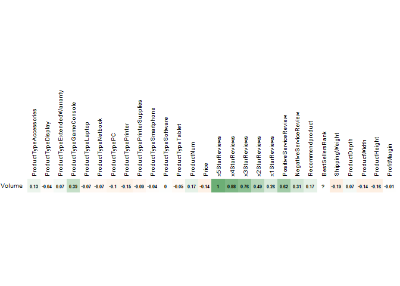
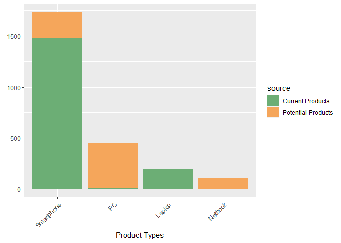

Product Sales Predictions
================
JRyback
2022-11-30

# Product Sales Predictions

Blackwell’s sales team had some concerns about the product sales in one
store that had not been performing as well as they had hoped. They had
been tracking sales performance based on product type to better
understand their sales data. The sales team approached me to predict how
well new products may fare if added to Blackwell stores. They were
especially interested in how sales would be for PCs, laptops, netbooks,
and smartphones. They also wanted to compare sales volume to customer
reviews to see if they had an impact.

``` r
library(tidyverse)
```

    ## ── Attaching packages ─────────────────────────────────────── tidyverse 1.3.2 ──
    ## ✔ ggplot2 3.3.6      ✔ purrr   0.3.4 
    ## ✔ tibble  3.1.8      ✔ dplyr   1.0.10
    ## ✔ tidyr   1.2.1      ✔ stringr 1.4.1 
    ## ✔ readr   2.1.2      ✔ forcats 0.5.2 
    ## ── Conflicts ────────────────────────────────────────── tidyverse_conflicts() ──
    ## ✖ dplyr::filter() masks stats::filter()
    ## ✖ dplyr::lag()    masks stats::lag()

``` r
library(caret)
```

    ## Loading required package: lattice
    ## 
    ## Attaching package: 'caret'
    ## 
    ## The following object is masked from 'package:purrr':
    ## 
    ##     lift

``` r
library(ggplot2)
library(corrplot)
```

    ## corrplot 0.92 loaded

``` r
library(patchwork)
library(RColorBrewer)
```

The packages I will be using in this project. Tidyverse will help me
manipulate the data, and ggplot for its excellent customizable visuals.
Corrplot provides visualizations as well, but specifically for
correlation plots. Finally, Caret will help me generate the predictive
models.

## The Product Data

The dataset is very small as far as prediction datasets go. It came in
two separate files. Both have information on each product’s type, price,
number of reviews from 1-5 stars and positive and negative service
reviews and recommendations, weight, and dimensions.

### Products Sold

``` r
products1 <- read.csv('ProductSales/existingproductattributes2017.csv')
products2 <- unique(products1)
head(products2)
```

    ##   ProductType ProductNum   Price x5StarReviews x4StarReviews x3StarReviews
    ## 1          PC        101  949.00             3             3             2
    ## 2          PC        102 2249.99             2             1             0
    ## 3          PC        103  399.00             3             0             0
    ## 4      Laptop        104  409.99            49            19             8
    ## 5      Laptop        105 1079.99            58            31            11
    ## 6 Accessories        106  114.22            83            30            10
    ##   x2StarReviews x1StarReviews PositiveServiceReview NegativeServiceReview
    ## 1             0             0                     2                     0
    ## 2             0             0                     1                     0
    ## 3             0             0                     1                     0
    ## 4             3             9                     7                     8
    ## 5             7            36                     7                    20
    ## 6             9            40                    12                     5
    ##   Recommendproduct BestSellersRank ShippingWeight ProductDepth ProductWidth
    ## 1              0.9            1967           25.8        23.94         6.62
    ## 2              0.9            4806           50.0        35.00        31.75
    ## 3              0.9           12076           17.4        10.50         8.30
    ## 4              0.8             109            5.7        15.00         9.90
    ## 5              0.7             268            7.0        12.90         0.30
    ## 6              0.3              64            1.6         5.80         4.00
    ##   ProductHeight ProfitMargin Volume
    ## 1         16.89         0.15     12
    ## 2         19.00         0.25      8
    ## 3         10.20         0.08     12
    ## 4          1.30         0.08    196
    ## 5          8.90         0.09    232
    ## 6          1.00         0.05    332

The first has information about 80 products sold in Blackwell’s store.
It has the sales volume for each product, which the other dataset does
not.

### Potential Products

``` r
newprods1 <- read.csv('ProductSales/newproductattributes2017.csv')
newprods2 <- unique(newprods1)
summary(newprods2)
```

    ##  ProductType          ProductNum        Price        x5StarReviews    
    ##  Length:24          Min.   :171.0   Min.   :   8.5   Min.   :   0.00  
    ##  Class :character   1st Qu.:179.5   1st Qu.: 130.0   1st Qu.:  16.00  
    ##  Mode  :character   Median :193.5   Median : 275.0   Median :  46.00  
    ##                     Mean   :219.5   Mean   : 425.6   Mean   : 178.50  
    ##                     3rd Qu.:301.2   3rd Qu.: 486.5   3rd Qu.:  99.25  
    ##                     Max.   :307.0   Max.   :1999.0   Max.   :1525.00  
    ##  x4StarReviews    x3StarReviews    x2StarReviews    x1StarReviews   
    ##  Min.   :  0.00   Min.   :  0.00   Min.   :  0.00   Min.   :  0.00  
    ##  1st Qu.:  2.00   1st Qu.:  1.75   1st Qu.:  1.00   1st Qu.:  1.75  
    ##  Median : 10.50   Median :  4.50   Median :  4.00   Median : 13.00  
    ##  Mean   : 48.04   Mean   : 21.92   Mean   : 17.50   Mean   : 27.58  
    ##  3rd Qu.: 26.00   3rd Qu.: 16.75   3rd Qu.: 20.25   3rd Qu.: 35.25  
    ##  Max.   :437.00   Max.   :224.00   Max.   :160.00   Max.   :247.00  
    ##  PositiveServiceReview NegativeServiceReview Recommendproduct
    ##  Min.   : 0.00         Min.   : 0.000        Min.   :0.3000  
    ##  1st Qu.: 2.00         1st Qu.: 1.000        1st Qu.:0.6000  
    ##  Median : 5.00         Median : 3.500        Median :0.7000  
    ##  Mean   :13.46         Mean   : 5.667        Mean   :0.6708  
    ##  3rd Qu.:12.50         3rd Qu.: 7.500        3rd Qu.:0.8000  
    ##  Max.   :90.00         Max.   :23.000        Max.   :1.0000  
    ##  BestSellersRank    ShippingWeight    ProductDepth     ProductWidth   
    ##  Min.   :    1.00   Min.   : 0.200   Min.   : 0.000   Min.   : 0.000  
    ##  1st Qu.:   93.25   1st Qu.: 0.900   1st Qu.: 5.225   1st Qu.: 5.832  
    ##  Median :  750.50   Median : 4.450   Median : 8.000   Median : 9.950  
    ##  Mean   : 3957.62   Mean   : 7.802   Mean   : 9.094   Mean   :10.408  
    ##  3rd Qu.: 3150.00   3rd Qu.: 9.575   3rd Qu.:11.425   3rd Qu.:12.875  
    ##  Max.   :44465.00   Max.   :42.000   Max.   :21.890   Max.   :27.010  
    ##  ProductHeight     ProfitMargin        Volume 
    ##  Min.   : 0.000   Min.   :0.0500   Min.   :0  
    ##  1st Qu.: 0.400   1st Qu.:0.0975   1st Qu.:0  
    ##  Median : 0.985   Median :0.1150   Median :0  
    ##  Mean   : 3.541   Mean   :0.1817   Mean   :0  
    ##  3rd Qu.: 2.888   3rd Qu.:0.2000   3rd Qu.:0  
    ##  Max.   :25.800   Max.   :0.9000   Max.   :0

The second dataset has information about 24 products that Blackwell is
considering selling in its store to boost sales. This set has all the
same variables except the sales volume. I will be trying to predict the
sales volume in these new products to determine whether adding them to
stores would boost sales.

## Cleaning the Data

In order for me to perform a regression algorithm on the data, all
variables need to be numeric. As shown above, the product type column is
a character class. I will need to split it into many binary columns, one
for each unique product type in the column. The value will either be a 1
or 0 depending on whether the object’s product type matches that in the
column. This is called dummifying the data.

``` r
dumdums <- dummyVars('~.', data=products2)
products3 <- data.frame(predict(dumdums, newdata = products2))
corrplot(cor(products3)[29, 1:28, drop=F],tl.cex=0.6, method='color', cl.pos='n',tl.col='black',addCoef.col = 'black', number.digits=2, number.cex=.5, col=colorRampPalette(c('#F5A65B','white','#6CAE75'))(100), mar=c(0,0,0,0)) 
```

<!-- -->

After adding the dummy variables, I created a correlation plot to see
which variables would have the most effect on the sales volume. As a
group, the reviews had the highest correlation. Note the perfect
correlation in the 5 star reviews column. The product types were varied
and the price and dimensions of the product had a minimal, but negative,
effect. There is not enough information on the best sellers rank. This
is likely because there are some NA values.

In a larger dataset we could simply remove the observations with the NA
values, but since there are only 80 observations it’s better to remove
the column altogether. I will also remove the ProfitMargin column
because it has almost no correlation whatsoever. The second dataset will
need to match the first if I am to make any predictions with it, so I
will also remove these columns from the other dataset, as well as
dummify the product types column.

``` r
#Removing columns from products dataset
products4 <- products3 %>% select(!c(BestSellersRank, ProfitMargin))
#Modifying the potential product dataset to match
dumdums2 <- dummyVars('~.', data=newprods2)
newprods3 <- data.frame(predict(dumdums, newdata = newprods2))
newprods4 <- newprods3 %>% select(!c(BestSellersRank, ProfitMargin))
```

## Visuals and Exploration

Now that we’ve cleaned the data a bit, we can take a look to see if we
can glean anything from the visuals.

The sales team in particular is interested in finding out the potential
sales for four product types; PCs, laptops, notebooks, and smartphones.
Let’s look at the current sales divided by product type. The bars in
this graph represent the total sales of all the products labeled in that
product type.

``` r
Accessories <- filter(products2, ProductType=='Accessories')
OtherProducts <- filter(products2, ProductType!='Accessories')
ptp1 <- ggplot(data=OtherProducts, aes(x=reorder(ProductType, -Volume, FUN=sum), y=Volume)) + geom_bar(stat='identity', fill='#6CAE75') +
  theme(legend.position='none')+ ylab(element_blank()) + xlab('Product Types') + theme(axis.text.x=element_text(angle=45, vjust=1, hjust=1)) + labs(title='Sales Volume by Product Type')
ptp2 <- ggplot(data=Accessories, aes(x=reorder(ProductType, -Volume, FUN=sum), y=Volume)) + geom_bar(stat='identity', fill='#6CAE75')+
  theme(axis.text.x=element_text(angle=45, vjust=1, hjust=1)) + xlab(element_blank()) + ylab('Sales Volume')
ptp2+ptp1 + plot_layout(widths=c(1,10))
```

<!-- -->

The accessories did so well that the bar needed its own scale! It did
more than twice as well as the second-best performing product type; the
extended warranty. The target product types did not perform as well in
comparison.The smartphones performed about in the middle of the pack,
while the laptops, PCs and Netbooks trailed behind.

From the correlation plot above, the reviews had a strong correlation
with the sales volume. Let’s see what’s going on there!

``` r
ggplot(data=products2) + 
  geom_point(mapping=aes(x=x5StarReviews, y=Volume, color=ProductType)) +
  labs(title='Correlation to Volume by Reviews', x='5 Star Reviews', y='Sales Volume') + scale_color_manual(values=c('#6CAE75','#6CAE75','#6CAE75','#6CAE75','#F5A65B','#F5A65B','#F5A65B','#6CAE75','#6CAE75','#F5A65B','#6CAE75','#6CAE75'))
```

<!-- -->

The 5 star reviews have a perfect linear correlation with the sales
volume! While it make our algorithm extremely accurate among the product
data we have already, data is rarely so clean. This will likely be a
problem when it comes to predicting how well new products will do!

When we compare it to the bar graph above we can see that about half of
the sales of accessories were from one product that sold particularly
well, and most of the Game Consoles’ sales can also be attributed to one
product. Both of these products got a lot of five-star reviews. The
target products are in orange, but none of them performed particularly
well.

## Predictive Algorithms

I tested four different regression algorithms; linear regression,
support vector machine, random forest, and gradient boosting. To measure
how well the algorithm did, I used a metric called the Root Mean Square
Error. It measures how far the testing predictions were from the actual
answers. To get the RMSE, you take the difference between the predicted
answer and the true answer for each point, calculate the mean, then take
the square root of that mean. A lower RMSE means the predicted answers
are closer to the real answers, and is likely to be a more reliable
algorithm.

``` r
set.seed(123)
prodTraining <- createDataPartition(products4$Volume, p=.75, list=FALSE)
prodTrain <- products4[prodTraining,]
prodTest <- products4[-prodTraining,]
fitCon <- trainControl(method='repeatedcv', number=3, repeats=1)
```

Before I get into any algorithms, I am splitting the data into training
and test sets. We will use 75% of the dataset to train the algorithm on
the best course of action, and the testing set will test its
reliability. It will allow us to test our algorithms using 3-fold
cross-validation. It trains and tests the algorithm on three different
training and testing sets. More folds usually results in a more reliable
algorithm, but with the dataset being so small, too many folds means
smaller sets to train the data and possibly a skewed algorithm

### Linear Regression

The first algorithm up is the linear regression model. This model
attempts to fit a line to the data. The line that has the lowest RMSE
has the best fit and is the one the model goes with.

``` r
set.seed(123)
prodLM <- lm(Volume~., prodTrain)
summary(prodLM)
```

    ## Warning in summary.lm(prodLM): essentially perfect fit: summary may be
    ## unreliable

    ## 
    ## Call:
    ## lm(formula = Volume ~ ., data = prodTrain)
    ## 
    ## Residuals:
    ##        Min         1Q     Median         3Q        Max 
    ## -4.845e-13 -8.216e-14  6.600e-16  6.538e-14  1.161e-12 
    ## 
    ## Coefficients: (1 not defined because of singularities)
    ##                               Estimate Std. Error    t value Pr(>|t|)    
    ## (Intercept)                 -1.679e-12  8.260e-13 -2.033e+00  0.04967 *  
    ## ProductTypeAccessories       6.527e-13  3.539e-13  1.844e+00  0.07366 .  
    ## ProductTypeDisplay           6.889e-13  3.065e-13  2.247e+00  0.03103 *  
    ## ProductTypeExtendedWarranty  5.270e-13  4.428e-13  1.190e+00  0.24203    
    ## ProductTypeGameConsole       1.441e-12  5.117e-13  2.816e+00  0.00794 ** 
    ## ProductTypeLaptop            8.873e-13  5.005e-13  1.773e+00  0.08499 .  
    ## ProductTypeNetbook           9.916e-14  3.444e-13  2.880e-01  0.77514    
    ## ProductTypePC                1.003e-12  4.865e-13  2.061e+00  0.04677 *  
    ## ProductTypePrinter           6.744e-13  4.231e-13  1.594e+00  0.11992    
    ## ProductTypePrinterSupplies   5.969e-13  4.013e-13  1.487e+00  0.14590    
    ## ProductTypeSmartphone       -7.216e-14  2.999e-13 -2.410e-01  0.81125    
    ## ProductTypeSoftware          9.650e-13  3.867e-13  2.495e+00  0.01745 *  
    ## ProductTypeTablet                   NA         NA         NA       NA    
    ## ProductNum                   9.639e-15  4.177e-15  2.308e+00  0.02704 *  
    ## Price                        6.273e-17  2.482e-16  2.530e-01  0.80192    
    ## x5StarReviews                4.000e+00  7.936e-16  5.041e+15  < 2e-16 ***
    ## x4StarReviews               -1.117e-14  5.763e-15 -1.938e+00  0.06076 .  
    ## x3StarReviews                1.797e-14  1.475e-14  1.218e+00  0.23139    
    ## x2StarReviews                1.104e-14  1.765e-14  6.250e-01  0.53572    
    ## x1StarReviews               -3.589e-15  3.587e-15 -1.001e+00  0.32383    
    ## PositiveServiceReview        8.452e-16  1.415e-15  5.970e-01  0.55424    
    ## NegativeServiceReview        4.718e-15  1.074e-14  4.390e-01  0.66315    
    ## Recommendproduct            -1.213e-13  3.002e-13 -4.040e-01  0.68851    
    ## ShippingWeight              -1.468e-14  8.061e-15 -1.821e+00  0.07715 .  
    ## ProductDepth                -7.837e-16  3.745e-15 -2.090e-01  0.83544    
    ## ProductWidth                -2.614e-15  1.572e-14 -1.660e-01  0.86888    
    ## ProductHeight                1.282e-14  9.461e-15  1.355e+00  0.18401    
    ## ---
    ## Signif. codes:  0 '***' 0.001 '**' 0.01 '*' 0.05 '.' 0.1 ' ' 1
    ## 
    ## Residual standard error: 3.075e-13 on 35 degrees of freedom
    ## Multiple R-squared:      1,  Adjusted R-squared:      1 
    ## F-statistic: 7.29e+31 on 25 and 35 DF,  p-value: < 2.2e-16

Hooray! It’s a perfect fit! We’re done!!!

… not quite. As shown at the top of the summary, the perfect fit should
be a warning, not a measure of success. This high accuracy is due to the
perfect 1 to 1 correlation of the 5-star review to the sales volume in
the product dataset. Since the linear regression is trying to fit a line
onto the data, it simply put one along that line.

``` r
ggplot() +  geom_line(data=prodLM, mapping=aes(x=x5StarReviews, y=Volume), size=1.25) + geom_point(data=products2, mapping=aes(x=x5StarReviews, y=Volume, color='red')) + labs(title='Plotting the Linear Regression Model', x='5 Star Reviews', y='Sales Volume') + theme(legend.position='none')
```

<!-- -->

Like so. But what happens if we try to predict the new product dataset
using this model?

``` r
prodPredsLM <- predict(prodLM, newprods4)
prodPredsLM
```

    ##            1            2            3            4            5            6 
    ## 3.840000e+02 2.040000e+02 2.960000e+02 2.800000e+01 4.000000e+00 7.600000e+01 
    ##            7            8            9           10           11           12 
    ## 1.248000e+03 9.200000e+01 1.200000e+01 1.184000e+03 3.772000e+03 3.960000e+02 
    ##           13           14           15           16           17           18 
    ## 4.000000e+02 1.680000e+02 2.000000e+02 1.848000e+03 1.600000e+01 1.200000e+02 
    ##           19           20           21           22           23           24 
    ## 1.000000e+02 1.160000e+02 3.520000e+02 2.000000e+01 1.780468e-12 6.100000e+03

Right off the bat, these are some strange predictions. Scientific
notation?? It’s a pretty strong sign that this algorithm isn’t a good
fit.

Right now we’re testing to see which model will work best with
predicting future sales data. With a perfect correlation, we can’t
reliably know that new sales will follow that correlation. What happens
when I take the 5 star review column out of the algorithm? Do the
answers get any better?

``` r
set.seed(123)
prodLM2 <- lm(Volume~.-x5StarReviews, prodTrain)
summary(prodLM2)
```

    ## 
    ## Call:
    ## lm(formula = Volume ~ . - x5StarReviews, data = prodTrain)
    ## 
    ## Residuals:
    ##     Min      1Q  Median      3Q     Max 
    ## -605.16  -86.72   -2.65   72.73  513.93 
    ## 
    ## Coefficients: (1 not defined because of singularities)
    ##                              Estimate Std. Error t value Pr(>|t|)    
    ## (Intercept)                 -346.2794   691.4840  -0.501 0.619576    
    ## ProductTypeAccessories       468.1115   286.9278   1.631 0.111512    
    ## ProductTypeDisplay           427.0177   247.4841   1.725 0.093025 .  
    ## ProductTypeExtendedWarranty  347.7982   367.4793   0.946 0.350233    
    ## ProductTypeGameConsole      1774.1108   311.9890   5.686 1.82e-06 ***
    ## ProductTypeLaptop            531.5849   411.0358   1.293 0.204151    
    ## ProductTypeNetbook           480.8116   278.0403   1.729 0.092325 .  
    ## ProductTypePC                514.0985   399.5930   1.287 0.206462    
    ## ProductTypePrinter           882.2960   323.5981   2.727 0.009826 ** 
    ## ProductTypePrinterSupplies   502.1526   326.5997   1.538 0.132911    
    ## ProductTypeSmartphone        314.8757   246.4139   1.278 0.209487    
    ## ProductTypeSoftware          269.4917   321.7633   0.838 0.407812    
    ## ProductTypeTablet                  NA         NA      NA       NA    
    ## ProductNum                    -0.4500     3.5080  -0.128 0.898638    
    ## Price                          0.1861     0.2062   0.903 0.372567    
    ## x4StarReviews                 10.3350     4.5249   2.284 0.028370 *  
    ## x3StarReviews                  3.7374    12.3780   0.302 0.764439    
    ## x2StarReviews                 42.4029    13.0310   3.254 0.002478 ** 
    ## x1StarReviews                 -8.2458     2.6813  -3.075 0.004001 ** 
    ## PositiveServiceReview          4.5455     0.9164   4.960 1.70e-05 ***
    ## NegativeServiceReview        -29.8553     7.5255  -3.967 0.000332 ***
    ## Recommendproduct             -78.0258   251.8238  -0.310 0.758467    
    ## ShippingWeight                -7.1835     6.6652  -1.078 0.288311    
    ## ProductDepth                   8.6042     2.8002   3.073 0.004028 ** 
    ## ProductWidth                 -11.0130    13.0794  -0.842 0.405338    
    ## ProductHeight                 -5.9405     7.8862  -0.753 0.456182    
    ## ---
    ## Signif. codes:  0 '***' 0.001 '**' 0.01 '*' 0.05 '.' 0.1 ' ' 1
    ## 
    ## Residual standard error: 258.3 on 36 degrees of freedom
    ## Multiple R-squared:  0.9861, Adjusted R-squared:  0.9768 
    ## F-statistic: 106.1 on 24 and 36 DF,  p-value: < 2.2e-16

Now it’s a more realistic algorithm with an RMSE of 258.3. But how do
the predictions hold up?

``` r
prodPredsLM2 <- predict(prodLM2, prodTest)
```

    ## Warning in predict.lm(prodLM2, prodTest): prediction from a rank-deficient fit
    ## may be misleading

``` r
prodPredsLM2
```

    ##          5         12         15         17         18         27         33 
    ##   85.18145  524.39171 1549.99672  146.02757 3087.44726  -57.93008 -120.83682 
    ##         36         42         43         47         48         49         53 
    ## 1240.13532 -156.67837  481.29708 2164.33718 6074.03463   65.77598 3426.76327 
    ##         64         66         69         72         79 
    ##  140.85962   79.84527  559.48510  -65.22630  448.44165

Well, these results are even stranger. In addition to the scientific
notation these have negative numbers. I would hope that there would not
be negative sales. While we can’t rule the model out until we look at
some of the others, it’s not looking promising.

### Support Vector Machine

The next model I will use is the Support Vector Machine model. This
model attempts to classify each observation into categories separated by
a line. In regression algorithms the line can get very complicated, as
it can use 3 or more dimensions to determine categories.

``` r
prodSVM <- train(Volume~., data=products4, method='svmLinear', trControl=fitCon, tuneLength=1)
```

    ## Warning in .local(x, ...): Variable(s) `' constant. Cannot scale data.

    ## Warning in .local(x, ...): Variable(s) `' constant. Cannot scale data.

``` r
prodSVM
```

    ## Support Vector Machines with Linear Kernel 
    ## 
    ## 80 samples
    ## 26 predictors
    ## 
    ## No pre-processing
    ## Resampling: Cross-Validated (3 fold, repeated 1 times) 
    ## Summary of sample sizes: 53, 55, 52 
    ## Resampling results:
    ## 
    ##   RMSE     Rsquared   MAE     
    ##   104.266  0.9946912  63.26752
    ## 
    ## Tuning parameter 'C' was held constant at a value of 1

A very small RMSE. This algorithm includes the 5 star reviews. Let’s
check the predictions.

``` r
prodPredsSVM <- predict(prodSVM, prodTest)
prodPredsSVM
```

    ##          5         12         15         17         18         27         33 
    ##  383.33193  149.74154 1312.91877  -24.26965  831.02904  -14.39773  126.33184 
    ##         36         42         43         47         48         49         53 
    ## 1330.68974   64.21210  155.46253  909.00596 2290.85121   68.74739 1744.72071 
    ##         64         66         69         72         79 
    ## -128.72657  -95.88388  436.93017   95.34216 1549.51972

Even with the 5-star reviews included, we can see there are negative
predictions which should not be there. If there are negative predictions
for the test set for which we have all the information, there will be
negative predictions in new data. Not promising. Let’s check the other
models.

### Random Forest Regressor

The Random Forest model uses ‘decision trees’ to sort each of the
observations. A decision tree is a branching series of yes-or-no
questions the algorithm asks about the observations. The answer of one
question determines which question is asked next. The Random Forest
Regressor creates many of these trees to predict continuous data, hence
why it’s called a ‘forest’.

``` r
set.seed(123)
prodRF <- train(Volume~., data=products4, method='rf', trControl=fitCon, tuneLength=1, importance=T)
prodRF
```

    ## Random Forest 
    ## 
    ## 80 samples
    ## 26 predictors
    ## 
    ## No pre-processing
    ## Resampling: Cross-Validated (3 fold, repeated 1 times) 
    ## Summary of sample sizes: 53, 55, 52 
    ## Resampling results:
    ## 
    ##   RMSE     Rsquared   MAE     
    ##   882.668  0.7546125  261.2056
    ## 
    ## Tuning parameter 'mtry' was held constant at a value of 8

Hmmm, a higher RMSE than the other models, but that may mean it’s not
affected by a linear relationship. Let’s check the predictions.

``` r
prodPredsRF <- predict(prodRF, prodTest)
prodPredsRF
```

    ##           5          12          15          17          18          27 
    ##  340.134267  298.304933 1349.499733   40.542267  780.943733   28.563200 
    ##          33          36          42          43          47          48 
    ##   26.162667 1229.702933   87.974933   99.969867  885.465333 2981.309067 
    ##          49          53          64          66          69          72 
    ##   57.689600 1581.329467    9.484133    5.784400  407.189067   22.790400 
    ##          79 
    ## 1417.997867

No negative numbers or scientific notation. Definitely better results
than the first two models. What if we compared it with the real values
in the test set?

``` r
RFTestPreds <- prodTest
RFTestPreds$Volume <- prodPredsRF

ggplot() + geom_point(data=prodTest, mapping=aes(x=x5StarReviews, y=Volume)) + geom_point(data=RFTestPreds, mapping=aes(x=x5StarReviews, y=Volume, color='red')) + theme(legend.position='none')
```

<!-- -->

Honestly? Not a bad prediction. We’ll keep that in mind, but there is
one more model to test. Note that neither of the outlying values made it
into our test set. It appears that the predictions get farther off the
higher the actual value is.

### Gradient Boosting Machine

The Gradient Booster is one of the more powerful predictive algorithms.
It also uses decision trees, but instead of modifying existing trees,
the model adds more trees to reduce log loss. Log loss is a measurement
of how likely the prediction is to be a certain distance from the
correct answer. The output of the new tree is then added to the output
from the rest of the trees.

``` r
prodGB <- train(Volume~., data=products4, method='gbm', trControl=fitCon, tuneLength=1, verbose=F)
```

    ## Warning in (function (x, y, offset = NULL, misc = NULL, distribution =
    ## "bernoulli", : variable 9: ProductTypePrinterSupplies has no variation.

``` r
prodGB
```

    ## Stochastic Gradient Boosting 
    ## 
    ## 80 samples
    ## 26 predictors
    ## 
    ## No pre-processing
    ## Resampling: Cross-Validated (3 fold, repeated 1 times) 
    ## Summary of sample sizes: 52, 55, 53 
    ## Resampling results:
    ## 
    ##   RMSE      Rsquared   MAE     
    ##   1124.368  0.4846904  460.4195
    ## 
    ## Tuning parameter 'n.trees' was held constant at a value of 50
    ## Tuning
    ## 
    ## Tuning parameter 'shrinkage' was held constant at a value of 0.1
    ## 
    ## Tuning parameter 'n.minobsinnode' was held constant at a value of 10

Highest RMSE so far, but I think we’ve proven that that isn’t
necessarily a bad thing. Time to test the predictions.

``` r
prodPredsGB <- predict(prodGB, prodTest)
prodPredsGB
```

    ##  [1]  473.75822  314.19810 2138.03522  334.73296 1152.62566  -54.41250
    ##  [7] -256.55529 1507.61880  -54.41250 -127.75057 1638.55411 2877.36534
    ## [13] -134.35547 2409.83943  206.38056  206.38056  745.20171   52.75044
    ## [19] 1632.55776

More negative predictions. Not a good look.

## Improving our Model

Based on the predictions, I have decided to use the Random Forest
Regressor to predict the sales for the new products. It was the only
model that did not use negative numbers or scientific notation in its
predictions. The predicted values in the test set were also very close
to the actual sales values. I am going to try and improve the Random
Forest model using the RMSE as a metric. The lower the RMSE, the better.

First I am going to try and alter the train control. This function
allows us to test our algorithm multiple times in one go. Because the
dataset is so small, we can’t increase the folds in our cross-validation
set(the ‘number’ parameter), but we can repeat the cross-validation test
more than once. I’ll increase the ‘repeats’ parameter up to 3 times.

``` r
fitCon2 <- trainControl(method='repeatedcv', number=3, repeats=3)
set.seed(123)
prodRF2 <- train(Volume~., data=products4, method='rf', trControl=fitCon2, tuneLength=1, importance=T)
prodRF2
```

    ## Random Forest 
    ## 
    ## 80 samples
    ## 26 predictors
    ## 
    ## No pre-processing
    ## Resampling: Cross-Validated (3 fold, repeated 3 times) 
    ## Summary of sample sizes: 53, 55, 52, 54, 54, 52, ... 
    ## Resampling results:
    ## 
    ##   RMSE      Rsquared   MAE     
    ##   915.8847  0.7669882  272.5604
    ## 
    ## Tuning parameter 'mtry' was held constant at a value of 8

Well, the RMSE is actually larger. But let’s graph it!

``` r
prodPredsRF2 <- predict(prodRF2, prodTest)
RFTestPreds2 <- prodTest
RFTestPreds2$Volume <- prodPredsRF2
ggplot() + 
  geom_point(data=prodTest, mapping=aes(x=x5StarReviews, y=Volume)) + geom_point(data=RFTestPreds2, mapping=aes(x=x5StarReviews, y=Volume, color='red')) + theme(legend.position='none')
```

<!-- -->

It’s close, but not as good as the original.

Next, I’m going to try altering the tunelength parameter. This is sort
of a cheat where the computer will tune the algorithm automatically. The
number indicated in the parameter will be the number of how many
configurations the computer will try. In a Random Forest Regressor, each
configuration is called an mtry. You might get a better algorithm with a
higher tunelength, but it will take more computational power.

``` r
set.seed(123)
prodRF3 <- train(Volume~., data=products4, method='rf', trControl=fitCon, tuneLength=25, importance=T)
prodRF3
```

    ## Random Forest 
    ## 
    ## 80 samples
    ## 26 predictors
    ## 
    ## No pre-processing
    ## Resampling: Cross-Validated (3 fold, repeated 1 times) 
    ## Summary of sample sizes: 53, 55, 52 
    ## Resampling results across tuning parameters:
    ## 
    ##   mtry  RMSE       Rsquared   MAE     
    ##    2     988.7931  0.6982694  368.8507
    ##    3    1005.2283  0.6699337  330.9921
    ##    4     986.3043  0.6932594  303.4858
    ##    5     938.2243  0.7248548  286.3396
    ##    6     925.0091  0.7321176  275.5968
    ##    7     938.5243  0.7297465  272.2616
    ##    8     913.0266  0.7418273  263.4901
    ##    9     894.4244  0.7542331  255.5045
    ##   10     891.1915  0.7602057  252.4046
    ##   11     889.2342  0.7620521  244.3678
    ##   12     881.2696  0.7686998  242.2612
    ##   13     863.2155  0.7775439  236.0220
    ##   14     854.0872  0.7841366  232.4305
    ##   15     841.9072  0.7901049  230.0101
    ##   16     815.2450  0.8072705  217.1566
    ##   17     822.5502  0.8039371  219.2841
    ##   18     821.8590  0.8034494  217.4226
    ##   19     799.9326  0.8149246  213.6084
    ##   20     795.3141  0.8114717  215.7796
    ##   21     825.7480  0.7995399  218.4353
    ##   22     817.5371  0.8092055  212.8460
    ##   23     841.4793  0.7925454  218.9251
    ##   24     800.5324  0.8143659  209.6071
    ##   25     816.4149  0.8063873  212.9679
    ##   26     807.4181  0.8122389  207.0277
    ## 
    ## RMSE was used to select the optimal model using the smallest value.
    ## The final value used for the model was mtry = 20.

The best algorithm appears to be mtry 20. The RMSE is 795.

Let’s compare the test predictions to their actual values

``` r
prodPredsRF3 <- predict(prodRF3, prodTest)
RFTestPreds3 <- prodTest
RFTestPreds3$Volume <- prodPredsRF3
ggplot() + 
  geom_point(data=prodTest, mapping=aes(x=x5StarReviews, y=Volume)) + geom_point(data=RFTestPreds3, mapping=aes(x=x5StarReviews, y=Volume, color='red')) + theme(legend.position='none')
```

<!-- -->

They definitely follow the line more closely than the other predictions
did!

## Predicting the New Data

Now that we have our optimized model, let’s apply it to the new data
that Blackwell wants us to predict. First, the predictions!

``` r
finalPredsRF <- predict(prodRF3, newprods4)
finalPredsRF
```

    ##          1          2          3          4          5          6          7 
    ##  441.29373  182.62667  285.34600   30.79520    4.37600   78.55000 1224.54720 
    ##          8          9         10         11         12         13         14 
    ##  106.83387   12.95200 1197.83493 4932.28947  434.37573  550.65760  161.39440 
    ##         15         16         17         18         19         20         21 
    ##  259.41920 1833.08640   85.06893  167.90413  163.27640  186.93160  355.44133 
    ##         22         23         24 
    ##   88.86813   74.68293 4275.65680

Everything looks good so far.

Now we add the predicted values to the new product data as a new column.
We want it to match the existing product data, so we’ll be using the
same column headers.

``` r
newprods5 <- newprods2
newprods5$Volume <- finalPredsRF
head(newprods5)
```

    ##   ProductType ProductNum   Price x5StarReviews x4StarReviews x3StarReviews
    ## 1          PC        171  699.00            96            26            14
    ## 2          PC        172  860.00            51            11            10
    ## 3      Laptop        173 1199.00            74            10             3
    ## 4      Laptop        175 1199.00             7             2             1
    ## 5      Laptop        176 1999.00             1             1             1
    ## 6     Netbook        178  399.99            19             8             4
    ##   x2StarReviews x1StarReviews PositiveServiceReview NegativeServiceReview
    ## 1            14            25                    12                     3
    ## 2            10            21                     7                     5
    ## 3             3            11                    11                     5
    ## 4             1             1                     2                     1
    ## 5             3             0                     0                     1
    ## 6             1            10                     2                     4
    ##   Recommendproduct BestSellersRank ShippingWeight ProductDepth ProductWidth
    ## 1              0.7            2498           19.9        20.63        19.25
    ## 2              0.6             490           27.0        21.89        27.01
    ## 3              0.8             111            6.6         8.94        12.80
    ## 4              0.6            4446           13.0        16.30        10.80
    ## 5              0.3            2820           11.6        16.81        10.90
    ## 6              0.6            4140            5.8         8.43        11.42
    ##   ProductHeight ProfitMargin   Volume
    ## 1          8.39         0.25 441.2937
    ## 2          9.13         0.20 182.6267
    ## 3          0.68         0.10 285.3460
    ## 4          1.40         0.15  30.7952
    ## 5          0.88         0.23   4.3760
    ## 6          1.20         0.08  78.5500

``` r
newprods6 <- newprods4
newprods6$Volume <- finalPredsRF
head(newprods6)
```

    ##   ProductTypeAccessories ProductTypeDisplay ProductTypeExtendedWarranty
    ## 1                      0                  0                           0
    ## 2                      0                  0                           0
    ## 3                      0                  0                           0
    ## 4                      0                  0                           0
    ## 5                      0                  0                           0
    ## 6                      0                  0                           0
    ##   ProductTypeGameConsole ProductTypeLaptop ProductTypeNetbook ProductTypePC
    ## 1                      0                 0                  0             1
    ## 2                      0                 0                  0             1
    ## 3                      0                 1                  0             0
    ## 4                      0                 1                  0             0
    ## 5                      0                 1                  0             0
    ## 6                      0                 0                  1             0
    ##   ProductTypePrinter ProductTypePrinterSupplies ProductTypeSmartphone
    ## 1                  0                          0                     0
    ## 2                  0                          0                     0
    ## 3                  0                          0                     0
    ## 4                  0                          0                     0
    ## 5                  0                          0                     0
    ## 6                  0                          0                     0
    ##   ProductTypeSoftware ProductTypeTablet ProductNum   Price x5StarReviews
    ## 1                   0                 0        171  699.00            96
    ## 2                   0                 0        172  860.00            51
    ## 3                   0                 0        173 1199.00            74
    ## 4                   0                 0        175 1199.00             7
    ## 5                   0                 0        176 1999.00             1
    ## 6                   0                 0        178  399.99            19
    ##   x4StarReviews x3StarReviews x2StarReviews x1StarReviews PositiveServiceReview
    ## 1            26            14            14            25                    12
    ## 2            11            10            10            21                     7
    ## 3            10             3             3            11                    11
    ## 4             2             1             1             1                     2
    ## 5             1             1             3             0                     0
    ## 6             8             4             1            10                     2
    ##   NegativeServiceReview Recommendproduct ShippingWeight ProductDepth
    ## 1                     3              0.7           19.9        20.63
    ## 2                     5              0.6           27.0        21.89
    ## 3                     5              0.8            6.6         8.94
    ## 4                     1              0.6           13.0        16.30
    ## 5                     1              0.3           11.6        16.81
    ## 6                     4              0.6            5.8         8.43
    ##   ProductWidth ProductHeight   Volume
    ## 1        19.25          8.39 441.2937
    ## 2        27.01          9.13 182.6267
    ## 3        12.80          0.68 285.3460
    ## 4        10.80          1.40  30.7952
    ## 5        10.90          0.88   4.3760
    ## 6        11.42          1.20  78.5500

Notice that I included one version before the product type information
was dummified and one after. I did this for two reasons. One, the goal
of this project was only to evaluate this specific set of new product
data. The sales team did not express interest in creating their own
software to predict other potential products based on this algorithm, so
they do not need the dummified data. However, I wanted to make it
available to them, as the algorithm cannot run without it.

The second reason is that the sales team is particularly interested in
evaluating the sales potential of certain item types. It is easier for
them to compare product types when it is all located in one variable.

``` r
ggplot() + geom_line(data=prodLM, mapping=aes(x=x5StarReviews, y=Volume), size=1.25) + scale_color_manual(values=c('red'))+ geom_point(data=newprods5, mapping=aes(x=x5StarReviews, y=Volume, color=ProductType)) + scale_color_manual(values=c('#6CAE75','#6CAE75','#6CAE75','#6CAE75','#F5A65B','#F5A65B','#F5A65B','#6CAE75','#6CAE75','#F5A65B','#6CAE75','#6CAE75')) + 
 xlim(c(0,2000)) + ylim(c(0,7500))
```

    ## Scale for 'colour' is already present. Adding another scale for 'colour',
    ## which will replace the existing scale.

<!-- -->

These are the predicted values compared with the linear model we made
earlier. I did this because the current sales information followed this
line perfectly. It allows me to more easily compare the predictions to
the line than to other points

We can see that the majority of the predicted values run along this
line. As the predicted values get higher, the farther off the line they
stray. Although the predicted data does not match the existing set, in
this case it isn’t necessarily a bad thing. When one variable aligns
with the dependent variable too well, the pattern does not often
continue in real life. These predictions may prove to be more realistic.

``` r
products5 <- products2
products5$source <- 'existing'
newprods7 <- newprods5
newprods7$source <- 'new'
allproducts <- rbind(products5, newprods7)
head(allproducts)
```

    ##   ProductType ProductNum   Price x5StarReviews x4StarReviews x3StarReviews
    ## 1          PC        101  949.00             3             3             2
    ## 2          PC        102 2249.99             2             1             0
    ## 3          PC        103  399.00             3             0             0
    ## 4      Laptop        104  409.99            49            19             8
    ## 5      Laptop        105 1079.99            58            31            11
    ## 6 Accessories        106  114.22            83            30            10
    ##   x2StarReviews x1StarReviews PositiveServiceReview NegativeServiceReview
    ## 1             0             0                     2                     0
    ## 2             0             0                     1                     0
    ## 3             0             0                     1                     0
    ## 4             3             9                     7                     8
    ## 5             7            36                     7                    20
    ## 6             9            40                    12                     5
    ##   Recommendproduct BestSellersRank ShippingWeight ProductDepth ProductWidth
    ## 1              0.9            1967           25.8        23.94         6.62
    ## 2              0.9            4806           50.0        35.00        31.75
    ## 3              0.9           12076           17.4        10.50         8.30
    ## 4              0.8             109            5.7        15.00         9.90
    ## 5              0.7             268            7.0        12.90         0.30
    ## 6              0.3              64            1.6         5.80         4.00
    ##   ProductHeight ProfitMargin Volume   source
    ## 1         16.89         0.15     12 existing
    ## 2         19.00         0.25      8 existing
    ## 3         10.20         0.08     12 existing
    ## 4          1.30         0.08    196 existing
    ## 5          8.90         0.09    232 existing
    ## 6          1.00         0.05    332 existing

For ease of comparing the two datasets, I combined them into one. I
added a new column called ‘source’ that would differentiate which list
each product came from.

``` r
AllAccessories <- filter(allproducts, ProductType=='Accessories')
AllOtherProducts <- filter(allproducts, ProductType!='Accessories')
ptp3 <- ggplot(data=AllOtherProducts, aes(x=reorder(ProductType, -Volume, FUN=sum), y=Volume, fill=source)) + geom_bar(stat='identity')  + theme(axis.text.x=element_text(angle=45, vjust=1, hjust=1)) + ylab(element_blank()) + xlab('Product Types') + geom_col(position = position_stack(reverse = TRUE)) + scale_fill_manual(values=c('#6CAE75','#F5A65B'), labels=c('Current Products', 'Potential Products')) + theme(legend.position=c(0.75,0.7)) + labs(title='Total Sales: Current and Predicted')
ptp4 <- ggplot(data=AllAccessories, aes(x=reorder(ProductType, -Volume, FUN=sum), y=Volume, fill=source)) + geom_bar(stat='identity') + geom_col(position = position_stack(reverse = TRUE)) + theme(axis.text.x=element_text(angle=45, vjust=1, hjust=1)) + xlab(element_blank()) + ylab('Sales Volume')+ theme(legend.position='none') + scale_fill_manual(values=c('#6CAE75','#F5A65B'))
ptp4+ptp3 + plot_layout(widths=c(1,10))
```

<!-- -->

Overall, the products that were predicted to do the best are the tablets
and game consoles. I would recommend looking through the new products’
predicted volumes and adding the ones that were predicted to do well
into Blackwell’s stores. Let’s look closer at the target product types.

``` r
ggplot(data=AllOtherProducts[AllOtherProducts$ProductType==c('Smartphone','Netbook','PC','Laptop'),], aes(x=reorder(ProductType,-Volume, FUN=sum), y=Volume, fill=source)) + geom_bar(stat='identity')  + theme(axis.text.x=element_text(angle=45, vjust=1, hjust=1)) + ylab(element_blank()) + xlab('Product Types') + geom_col(position = position_stack(reverse = TRUE)) + scale_fill_manual(values=c('#6CAE75','#F5A65B'), labels=c('Current Products', 'Potential Products'))
```

<!-- -->

The PCs and Netbooks were predicted to do much better than their
counterparts already in store. The smartphones were also predicted to
sell fairly well but the laptops not so much. In particular, I would
recommend adding new smartphones, PCs, and Netbooks to stores.

I would highly recommend finding ways to boost positive reviews, as this
is the surest way to boost sales. For example, Blackwell could give
incentives such as store credit for leaving a product review.
