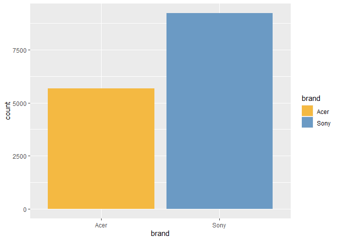

Survey Says
================
JRyback
November 28, 2022

# Customer Preferences

Blackwell’s sales team had engaged a marketing research firm to conduct
a survey of existing customers, in part to find which of two brands,
Acer or Sony, they preferred. The overall goal was to determine whether
the company should enter a deeper relationship with one of the two
companies, if at all. The completed survey data could then be used in
further analyses of sales, brand, or product information.

Unfortunately, the data for approximately one-third of the survey
results was corrupted and the brand preference was not properly
captured. They came to me hoping to use machine learning to recapture
the results of the corrupted part of the survey by using the uncorrupted
data.

``` r
library(caret)
```

    ## Loading required package: ggplot2

    ## Loading required package: lattice

``` r
library(ggplot2)
library(gbm)
```

    ## Loaded gbm 2.1.8.1

``` r
library(writexl)
```

The packages I will be using in this project are caret and ggplot2.
Ggplot2 for the excellent visualization. Caret will help us generate our
predictive models. GBM will help me examine the Gradient Boosting
Machine model that we will use. The sales team requested that we return
an excel file to them, so we will use writexl for the output.

## The Survey Data

The data came in two separate sets, one of the corrupted data, one of
uncorrupted data.

### Uncorrupted Survey Data

``` r
complete <- read.csv('SurveyData/CompleteResponses.csv')
#subbing in brand names to change data type
complete$brand <- sub('0', 'Acer', complete$brand)
complete$brand <- sub('1', 'Sony', complete$brand)
#checkiing for duplicate and null values 
complete <- unique(complete)
complete <- na.omit(complete)
summary(complete)
```

    ##      salary            age            elevel           car       
    ##  Min.   : 20000   Min.   :20.00   Min.   :0.000   Min.   : 1.00  
    ##  1st Qu.: 52082   1st Qu.:35.00   1st Qu.:1.000   1st Qu.: 6.00  
    ##  Median : 84950   Median :50.00   Median :2.000   Median :11.00  
    ##  Mean   : 84871   Mean   :49.78   Mean   :1.983   Mean   :10.52  
    ##  3rd Qu.:117162   3rd Qu.:65.00   3rd Qu.:3.000   3rd Qu.:15.75  
    ##  Max.   :150000   Max.   :80.00   Max.   :4.000   Max.   :20.00  
    ##     zipcode          credit          brand          
    ##  Min.   :0.000   Min.   :     0   Length:9898       
    ##  1st Qu.:2.000   1st Qu.:120807   Class :character  
    ##  Median :4.000   Median :250607   Mode  :character  
    ##  Mean   :4.041   Mean   :249176                     
    ##  3rd Qu.:6.000   3rd Qu.:374640                     
    ##  Max.   :8.000   Max.   :500000

### Corrupted Survey Data

``` r
incomplete <- read.csv('SurveyData/SurveyIncomplete.csv')
#Get rid of incorrect brand preference data, check for duplicates/null values
incomplete <- subset(incomplete, select=-c(brand))
incomplete <- unique(incomplete)
incomplete <- na.omit(incomplete)
summary(incomplete)
```

    ##      salary            age            elevel           car      
    ##  Min.   : 20000   Min.   :20.00   Min.   :0.000   Min.   : 1.0  
    ##  1st Qu.: 52590   1st Qu.:35.00   1st Qu.:1.000   1st Qu.: 6.0  
    ##  Median : 86221   Median :50.00   Median :2.000   Median :11.0  
    ##  Mean   : 85794   Mean   :49.94   Mean   :2.009   Mean   :10.6  
    ##  3rd Qu.:118535   3rd Qu.:65.00   3rd Qu.:3.000   3rd Qu.:16.0  
    ##  Max.   :150000   Max.   :80.00   Max.   :4.000   Max.   :20.0  
    ##     zipcode          credit      
    ##  Min.   :0.000   Min.   :     0  
    ##  1st Qu.:2.000   1st Qu.:122311  
    ##  Median :4.000   Median :250974  
    ##  Mean   :4.038   Mean   :249546  
    ##  3rd Qu.:6.000   3rd Qu.:375653  
    ##  Max.   :8.000   Max.   :500000

The uncorrupted data has about 9,900 observations while the corrupted
has about 4,600.. Each of them has information about the customers’
salary, age, education level, car model, region, and credit limit. The
uncorrupted data has the customers’ preferred brand as well. While the
corrupted data did have a value for the preferred brand, it is
considered unreliable. I removed it, to be replaced by the brand
predicted by the algorithm. I also replaced the numbered values in the
brand column (0 for Acer, 1 for Sony). This was to allow the algorithm
to compute the results in a classification model.

## Which customers prefer which brand?

``` r
ggplot(data=complete) + geom_bar(mapping=aes(brand, fill=brand)) +
  scale_fill_manual(values=c('#f4b942','#6b9ac4'))
```

<!-- -->

Immediately we can see that more people in the completed survey data
preferred Sony to Acer. Nearly double the number! Unless the algorithm
predicts many more people preferring Acer, Sony may be the way to go.

``` r
ggplot(data=complete) + geom_point(mapping=aes(x=salary, y=age, color=brand))+
  scale_color_manual(values=c('#f4b942','#6b9ac4'))
```

<!-- -->

While comparing the variables in the completed survey data, I found that
the customer’s salary had the most effect on their brand preference. The
second-most important variable was their age. The graph above shows that
people’s preferences can be determined by age and salary, in three large
groups. People under the age of 40 generally prefer to buy Acer products
if they earn between \$50,000 and \$100,000 annually. People who prefer
Acer and are between the ages of 40 and 60 have a slightly higher income
on average, anywhere between \$80,000 and \$120,000 a year. People above
60 years old will prefer to buy Acer products if they make 20,000 to
70,000. Anyone outside of those group tend to prefer Sony over Acer.
Notably, people with the highest salaries preferred Sony regardless of
age.

## Can we predict a customers’ brand preference?

The brand data is binary, meaning it only has two choices for an
algorithm to choose from; Sony and Acer. This bodes well for our
algorithm, since binary algorithms generally do better than other types.
I will be trying three different types of categorical models; Random
Forest, C5.0, and Gradient Boosting Machine.

The first step is to separate the data into training and test sets. I
made two sets, with the training having 75% of the uncorrupted survey
data. I will test the models with a 10-fold cross-validation.

``` r
set.seed(123)
inTraining <- createDataPartition(complete$brand, p=.75, list=FALSE)
train <- complete[inTraining,]
test <- complete[-inTraining,]
fitCon <- trainControl(method='repeatedcv', number=10, repeats=1)
```

### Random Forest

The first model we will try is the Random Forest Classifier.

``` r
set.seed(123)
SurveyRF <- train(brand~., data=train, method='rf', trControl=fitCon, tuneLength=5)
SurveyRF
```

    ## Random Forest 
    ## 
    ## 7424 samples
    ##    6 predictor
    ##    2 classes: 'Acer', 'Sony' 
    ## 
    ## No pre-processing
    ## Resampling: Cross-Validated (10 fold, repeated 1 times) 
    ## Summary of sample sizes: 6681, 6681, 6681, 6682, 6681, 6683, ... 
    ## Resampling results across tuning parameters:
    ## 
    ##   mtry  Accuracy   Kappa    
    ##   2     0.9176981  0.8252764
    ##   3     0.9176985  0.8252930
    ##   4     0.9171598  0.8240410
    ##   5     0.9155429  0.8203682
    ##   6     0.9132536  0.8155551
    ## 
    ## Accuracy was used to select the optimal model using the largest value.
    ## The final value used for the model was mtry = 3.

The highest score for the random forest’s accuracy is 91.77%. That’s
very good, but we should still try the other models! The kappa is a bit
lower, at 82.52. The kappa takes the expected accuracy into account and
measures the agreement between inter-raters. Two raters (or more) will
apply the same criteria to determine whether or not some condition
occurs. For example, the raters make a prediction on which brand each
person prefers based on the dependent data from the survey (age, salary,
education, etc.) and the predictive algorithm used. If they agree on
most accounts, then the criteria is considered reliable. Even though the
kappa is a bit lower than the accuracy, it is still a very good score
and can be considered reliable.

``` r
confusionMatrix(SurveyRF)
```

    ## Cross-Validated (10 fold, repeated 1 times) Confusion Matrix 
    ## 
    ## (entries are percentual average cell counts across resamples)
    ##  
    ##           Reference
    ## Prediction Acer Sony
    ##       Acer 33.9  4.3
    ##       Sony  4.0 57.9
    ##                             
    ##  Accuracy (average) : 0.9177

The confusion matrix shows that it correctly predicted about 34% of the
testing set to prefer Acer, and 58% to prefer Sony. The incorrect
predictions were about even. It incorrectly predicted Acer 4.3% of the
time and Sony 4%.

``` r
varImp(SurveyRF)
```

    ## rf variable importance
    ## 
    ##         Overall
    ## salary  100.000
    ## age      59.183
    ## credit    8.608
    ## car       3.207
    ## zipcode   1.557
    ## elevel    0.000

The salary variable was used the most, with the age as a distant second.
The other variables were barely considered at all. As we saw above, the
customers’ age had a significant effect on their preference.

### C5.0

The second model we will try is the C5.0 Classifier.

``` r
set.seed(123)
SurveyC50 <- train(brand~., data=train, method='C5.0', trControl=fitCon, tuneLength=5)
SurveyC50
```

    ## C5.0 
    ## 
    ## 7424 samples
    ##    6 predictor
    ##    2 classes: 'Acer', 'Sony' 
    ## 
    ## No pre-processing
    ## Resampling: Cross-Validated (10 fold, repeated 1 times) 
    ## Summary of sample sizes: 6681, 6681, 6681, 6682, 6681, 6683, ... 
    ## Resampling results across tuning parameters:
    ## 
    ##   model  winnow  trials  Accuracy   Kappa    
    ##   rules  FALSE    1      0.8715035  0.7374790
    ##   rules  FALSE   10      0.9145968  0.8172643
    ##   rules  FALSE   20      0.9136557  0.8162084
    ##   rules  FALSE   30      0.9143285  0.8178341
    ##   rules  FALSE   40      0.9143285  0.8178341
    ##   rules   TRUE    1      0.8739270  0.7423625
    ##   rules   TRUE   10      0.9178316  0.8246847
    ##   rules   TRUE   20      0.9183689  0.8265408
    ##   rules   TRUE   30      0.9175606  0.8250153
    ##   rules   TRUE   40      0.9175606  0.8250153
    ##   tree   FALSE    1      0.8688088  0.7251092
    ##   tree   FALSE   10      0.9154085  0.8203838
    ##   tree   FALSE   20      0.9166194  0.8231234
    ##   tree   FALSE   30      0.9166198  0.8230728
    ##   tree   FALSE   40      0.9166198  0.8230728
    ##   tree    TRUE    1      0.8721757  0.7320037
    ##   tree    TRUE   10      0.9160781  0.8219108
    ##   tree    TRUE   20      0.9160772  0.8221864
    ##   tree    TRUE   30      0.9158081  0.8216353
    ##   tree    TRUE   40      0.9158081  0.8216353
    ## 
    ## Accuracy was used to select the optimal model using the largest value.
    ## The final values used for the model were trials = 20, model = rules and
    ##  winnow = TRUE.

This one did about as well as the Random Forest model, but slightly
better! The accuracy was 91.83%, while the kappa was 82.65. They’re very
close!

``` r
confusionMatrix(SurveyC50)
```

    ## Cross-Validated (10 fold, repeated 1 times) Confusion Matrix 
    ## 
    ## (entries are percentual average cell counts across resamples)
    ##  
    ##           Reference
    ## Prediction Acer Sony
    ##       Acer 33.8  4.1
    ##       Sony  4.0 58.1
    ##                             
    ##  Accuracy (average) : 0.9184

The confusion matrix for the C5.0 model looks very similar to that of
the Random Forest Model. It had slightly more incorrect predictions for
Acer at 4.4%.

``` r
varImp(SurveyC50)
```

    ## C5.0 variable importance
    ## 
    ##         Overall
    ## salary   100.00
    ## age      100.00
    ## credit    84.05
    ## car       63.08
    ## zipcode    0.00
    ## elevel     0.00

The C5.0 model placed the age and salary variables at equal importance.
While these were the two variables that were observed to have the most
effect, I wonder if putting them on an equal footing is the best
solution. The credit and car variables were also factored into the
algorithm. Notably, the education level and zip code had no effect.

### Gradient Boosting Machine

The third and final model we will test is the Gradient Boosting Machine
model.

``` r
set.seed(123)
SurveyGBM <- train(brand~., data=train, method='gbm', verbose=FALSE, trControl=fitCon, tuneLength=5)
SurveyGBM 
```

    ## Stochastic Gradient Boosting 
    ## 
    ## 7424 samples
    ##    6 predictor
    ##    2 classes: 'Acer', 'Sony' 
    ## 
    ## No pre-processing
    ## Resampling: Cross-Validated (10 fold, repeated 1 times) 
    ## Summary of sample sizes: 6681, 6681, 6681, 6682, 6681, 6683, ... 
    ## Resampling results across tuning parameters:
    ## 
    ##   interaction.depth  n.trees  Accuracy   Kappa    
    ##   1                   50      0.7272367  0.4242049
    ##   1                  100      0.7279105  0.4245751
    ##   1                  150      0.7288545  0.4254531
    ##   1                  200      0.7271028  0.4211278
    ##   1                  250      0.7276414  0.4216047
    ##   2                   50      0.8228618  0.6278531
    ##   2                  100      0.8846968  0.7588787
    ##   2                  150      0.9063819  0.8023207
    ##   2                  200      0.9158113  0.8216188
    ##   2                  250      0.9171563  0.8244805
    ##   3                   50      0.8794459  0.7508510
    ##   3                  100      0.9062499  0.8032499
    ##   3                  150      0.9175639  0.8259483
    ##   3                  200      0.9198525  0.8303712
    ##   3                  250      0.9214684  0.8338808
    ##   4                   50      0.8911657  0.7734609
    ##   4                  100      0.9189094  0.8288951
    ##   4                  150      0.9199860  0.8309545
    ##   4                  200      0.9209292  0.8327892
    ##   4                  250      0.9202562  0.8311880
    ##   5                   50      0.9199874  0.8307170
    ##   5                  100      0.9226799  0.8361310
    ##   5                  150      0.9211973  0.8329874
    ##   5                  200      0.9201218  0.8305823
    ##   5                  250      0.9202564  0.8307951
    ## 
    ## Tuning parameter 'shrinkage' was held constant at a value of 0.1
    ## 
    ## Tuning parameter 'n.minobsinnode' was held constant at a value of 10
    ## Accuracy was used to select the optimal model using the largest value.
    ## The final values used for the model were n.trees = 100, interaction.depth =
    ##  5, shrinkage = 0.1 and n.minobsinnode = 10.

This model performed very well as well. It did better than the other
models but only slightly. The best accuracy score was 92.27%, with its
kappa as 83.61.

``` r
confusionMatrix(SurveyGBM)
```

    ## Cross-Validated (10 fold, repeated 1 times) Confusion Matrix 
    ## 
    ## (entries are percentual average cell counts across resamples)
    ##  
    ##           Reference
    ## Prediction Acer Sony
    ##       Acer 34.3  4.2
    ##       Sony  3.5 58.0
    ##                             
    ##  Accuracy (average) : 0.9227

The cross-validation shows why it performed better than the other
models. The correct predictions and the incorrect Acer predictions are
about the same, but a bit higher for the correct predictions, and lower
for the incorrect ones. The real change is when the algorithm
incorrectly predicted Sony. While both the other models predicted Sony
incorrectly 4% of the time, the Gradient Boosting Machine predicted it
3.5%. While the difference is very small, when the algorithms’ accuracy
are so close every bit counts.

``` r
varImp(SurveyGBM)
```

    ## gbm variable importance
    ## 
    ##           Overall
    ## salary  100.00000
    ## age      93.50622
    ## credit    1.20715
    ## zipcode   0.16600
    ## car       0.04148
    ## elevel    0.00000

As with the Random Forest Model, the salary was the most important
variable, followed by the age. The importance of the age variable seems
to have hit a happy medium at 93.5% - it may be the cause of the lower
percent of incorrect Sony guesses. The other variables were barely
considered, with the education not factoring in at all.

## Predictions

Now that we’ve run and evaluated our models, it’s time to apply them to
the corrupted data!

I have decided to use the Gradient Boosting Machine. Though the accuracy
of each algorithm was very close, the Gradient Boosting Machine had the
highest accuracy. Not only that, the Confusion matrix showed it had the
highest accuracy in all of the correct prediction areas and the least
amount in the incorrect areas.

### Gradient Boosting Machine

``` r
TestGBM <- predict(SurveyGBM, newdata=incomplete, interval='prediction')
incomplete$brand <- TestGBM
summary(incomplete)
```

    ##      salary            age            elevel           car      
    ##  Min.   : 20000   Min.   :20.00   Min.   :0.000   Min.   : 1.0  
    ##  1st Qu.: 52590   1st Qu.:35.00   1st Qu.:1.000   1st Qu.: 6.0  
    ##  Median : 86221   Median :50.00   Median :2.000   Median :11.0  
    ##  Mean   : 85794   Mean   :49.94   Mean   :2.009   Mean   :10.6  
    ##  3rd Qu.:118535   3rd Qu.:65.00   3rd Qu.:3.000   3rd Qu.:16.0  
    ##  Max.   :150000   Max.   :80.00   Max.   :4.000   Max.   :20.0  
    ##     zipcode          credit        brand     
    ##  Min.   :0.000   Min.   :     0   Acer:1927  
    ##  1st Qu.:2.000   1st Qu.:122311   Sony:3073  
    ##  Median :4.000   Median :250974              
    ##  Mean   :4.038   Mean   :249546              
    ##  3rd Qu.:6.000   3rd Qu.:375653              
    ##  Max.   :8.000   Max.   :500000

Here I am creating the predictions for the brand preference of the
corrupted data using the other answers that the customers gave and the
Gradient Boosting model. Then I can add it to the incomplete data as an
additional column.

``` r
ggplot(data=incomplete) + geom_bar(mapping=aes(brand, fill=brand)) +
  scale_fill_manual(values=c('#f4b942','#6b9ac4'))
```

<!-- -->

Like the uncorrupted data, we can see that the algorithm has predicted
more people preferred Sony to Acer. Next step is to combine the
completed survey data with the now complete corrupted data.

``` r
completedSurveyData <- rbind(complete, incomplete)
summary(completedSurveyData)
```

    ##      salary            age            elevel           car       
    ##  Min.   : 20000   Min.   :20.00   Min.   :0.000   Min.   : 1.00  
    ##  1st Qu.: 52287   1st Qu.:35.00   1st Qu.:1.000   1st Qu.: 6.00  
    ##  Median : 85310   Median :50.00   Median :2.000   Median :11.00  
    ##  Mean   : 85181   Mean   :49.83   Mean   :1.992   Mean   :10.55  
    ##  3rd Qu.:117714   3rd Qu.:65.00   3rd Qu.:3.000   3rd Qu.:16.00  
    ##  Max.   :150000   Max.   :80.00   Max.   :4.000   Max.   :20.00  
    ##     zipcode         credit          brand          
    ##  Min.   :0.00   Min.   :     0   Length:14898      
    ##  1st Qu.:2.00   1st Qu.:121256   Class :character  
    ##  Median :4.00   Median :250732   Mode  :character  
    ##  Mean   :4.04   Mean   :249300                     
    ##  3rd Qu.:6.00   3rd Qu.:375199                     
    ##  Max.   :8.00   Max.   :500000

Now the data is all together in one nice dataset, we can take a look at
everything together.

``` r
ggplot(data=completedSurveyData) + geom_bar(mapping=aes(brand, fill=brand)) +
  scale_fill_manual(values=c('#f4b942','#6b9ac4'))
```

<!-- -->

The original purpose of the survey was to determine which brand, Acer or
Sony, to enter into a deeper partnership. In the completed survey
information, nearly twice as many people preferred Sony over Acer. This
trend continued in the predicted results. Overall, about 9,200 people
preferred Sony. There were only around 5,600 whose preference was Acer.
Also, as we saw above, people with the highest salaries preferred Sony
regardless of age, education, or other factors.

For these reasons, I would recommend that Blackwell Electronics deepen
its relationship with Sony. It would encourage people who prefer Sony to
come to Blackwell to purchase its products. As for the poeple who prefer
Acer, the marketing team could use the age and salary information to
create more targeted advertisements to draw them in.

Now all that’s left is to export the file to excel and send it on over
to marketing!

``` r
write_xlsx(completedSurveyData, path =tempfile(fileext='.xlsx'))
```
